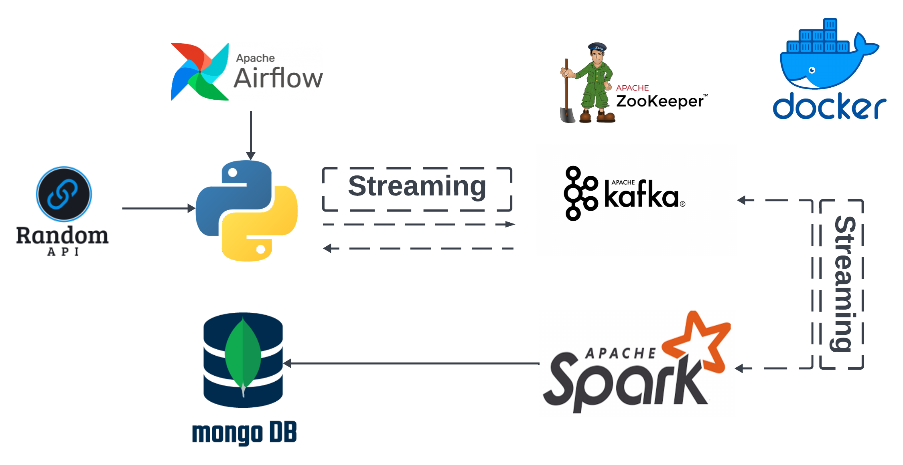
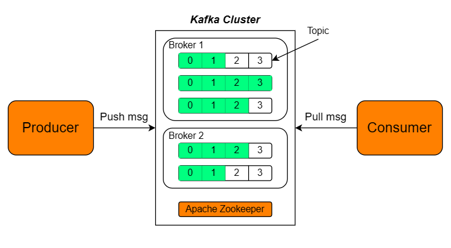
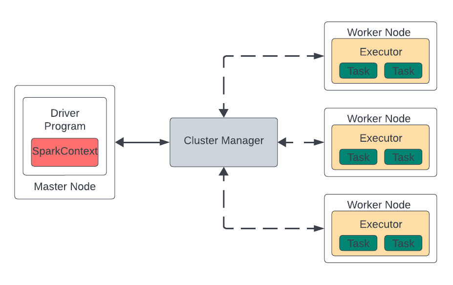

# Streaming Processing with Python, Kafka and Spark

This repo illustrates the Spark Structured Streaming.

Tech stack: Python, Airflow, Spark(PySpark), Kafka, MongoDB and Docker.

Table of contents:

* Information
* Apache Airflow
* Apache Kafka
* Apache Spark (Structured Streaming)
* MongoDB

# Information

Retrieve data from the Random API, transmit it to various Kafka topics at random intervals using Airflow. Utilize Spark Structured Streaming to read data from multiple Kafka topics and write them into MongoDB tables. Deploy this Spark application with one Master Node and several Worker Nodes via Docker.

`stream_to_kafka_dag.py` -> The DAG script that writes the API data to Kafka producer

`stream_to_kafka.py` -> The script that gets the data from API and sends it to Kafka topic

`spark_streaming.py` -> The script that consumes the data from Kafka topics with Spark Structured Streaming

# Apache Airflow

[Apache Airflow](https://airflow.apache.org/docs/apache-airflow/stable/index.html) is an open-source platform for developing, scheduling, and monitoring batch-oriented workflows.

Run the docker-compose-airflow.yaml to start the Airflow container, all necessary modules will be automatically installed:

`docker-compose -f docker-compose-airflow.yaml up -d`

This docker compose will create 2 new containers:

* **postgres:** This container hosts a PostgreSQL database to store metadata from Airflow. It runs using the official PostgreSQL image from Dockerhub (image `postgresql` version `13`)
* **webserver:** This container offers a graphical interface for users to interact. It is built from a custom image, derived from the `puckel/docker-airflow` image version `1.10.9`.

Once the Airflow container is up and running, you can access the UI at `https://localhost:8080`

Manually trigger the Directed Acyclic Graph (DAG) to initiate the streaming process. Once triggered, the code begins retrieving data from the API and concurrently produces data into multiple topics in Kafka. This manual initiation allows for precise control over the streaming workflow, ensuring timely and synchronized data processing.

# Apache Kafka

[Apache Kafka](https://kafka.apache.org/) is an open-source distributed event streaming platform used by thousands of companies for high-performance data pipelines, streaming analytics, data integration, and mission-critical applications.

Run this command: `docker-compose -f docker-compose-kafka.yaml up -d` to create multinode Kafka cluster for streaming process, we define the replication factor as 3 since there are 3 nodes (kafka1, kafka2, kafka3). We can also see the Kafka UI on `localhost:8888`.

This docker compose will create 7 new containers:

* **zoo:** This container establishes a Zookeeper instance responsible for tracking the status and data of Kafka cluster nodes. It runs using the `confluentinc/cp-zookeeper` image version `7.3.2` from Dockerhub
* **kafka1, kafka2, kafka3:** These container create 3 Kafka servers (brokers) with a replication factor of 3. They run using the `confluentinc/cp-kafka` version `7.3.2` image from Dockerhub
* **kafka-connect:** This container establishes a connector between the Kafka server and an external system. It runs using `confluentinc/cp-kafka-connect` image version `7.3.2` from Dockerhub
* **kafka-ui:** This container provides a versatile, fast, and lightweight web user interface for managing Kafka clusters. It runs using the `provectuslabs/kafka-ui` image version `latest` from Dockerhub
* **mongodb:** This container sets up a MongoDB database to store data from Kafka topics. It operates using the `mongo` image version `7` from Dockerhub.

Kafka Cluster Architecture:

* Broker: handle hundreds of thousands of read and write per second without performance impact
* Producer: Publish messages to brokers when start, automatically connect to another Producers
* Consumer: Subscribe data from brokers, keeps track of how many messages have been consumed by keeping track of the partition offset
* Zookeeper: coordinate, manage and report status of Kafka broker in Kafka system, perform Kafka broker - leader election. Send the notifications of presence or absence of broker, producers and consumers make the decision and begin coordinating their work with another broker.
* Topic: stream of data, data in topic was organised with FIFO rule

# Apache Spark (Structured Streaming)

[Apache Spark](https://spark.apache.org/) is a multi-language engine for executing data engineering, data science, and machine learning on single-node machines or clusters.

[Spark Structured Streaming](https://spark.apache.org/docs/latest/structured-streaming-programming-guide.html) is a scalable and fault-tolerant stream processing engine built on the Spark SQL engine.

To create multinodes in Spark Standalone mode with 1 Master node and 6 Worker nodes in a Spark cluster, run this command:

`docker-compose -f docker-compose-spark.yaml up -d.`

This docker compose will create 7 new containers:

* **spark-master:** This container establishes a Master instance. It runs using `bitnami/spark` image version `3` from Dockerhub
* **spark-worker-1, spark-worker-2, spark-worker-3, spark-worker-4, spark-worker-5, spark-worker-6:** These container establish 6 Worker instances, enabling parallel execution of Spark jobs. Each Worker node is configured to run 1 `spark-submit` command, allowing it to consume and process data from the corresponding topic before inserting the processed data into a MongoDB database. This parallel processing capability enhances the overall efficiency and throughput of the Spark cluster.

***Spark Architecture:***

* Master Node: split and schedule Spark jobs to be executed into executors in Spark cluster. SparkContext is a gateway which is created by driver to monitor the job and connect to cluster. Driver program call the application and create SparkContext
* Spark Executor: is responsible to run a job and store data in cache. The executor run the application concurrectly. The executors are allocated dynamically and constantly added and removed during the execution of the tasks.
* Cluster Manager: dynamically allocated resources to executors in Worker node.
* Worker Node: execute jobs, return the results back to SparkContext, handle many jobs in parrellel by divide job into multiple sub-jobs on multiple machines.

**Advantage:* Each Worker node operates tasks independently, preventing conflicts between the spark-context of each Spark Session. This separation ensures smooth and efficient parallel processing within the Spark cluster, enhancing overall stability and performance.

**Disadvantage:* Deploying multiple Worker nodes in parallel demands significant resources from the host machine, including CPU, RAM, and Disk space. This resource-intensive nature can pose challenges, especially for machines with limited capacities, potentially affecting overall system performance and responsiveness.

# MongoDB

[MongoDB](https://www.mongodb.com/what-is-mongodb) is a No-SQL database to store data in flexible, JSON-like documents.

When executing the command `docker-compose -f docker-compose-kafka.yaml up -d` , a MongoDB database container will be created. This container automatically create database and collections when starting by mounting the Javascript file `mongo/mongo-init.js` into `docker-entrypoint-initdb.d`

You can use the `-it` option with `docker exec` to run an interactive command inside the container:

`docker exec -it <container_id_or_name> bash`

To access the running database container with a specified username and password, you can use the following commands:

`mongosh - u <username> -p <password>`

`use <database>`

`use <collection>`

To query data from the chosen collection, you can use the `find()` method. For example, to query data with a specific ID:

`db.<collection>.find({ id: <value> })`

This command retrieves data from the specified collection where the `id` field matches the provided `<value>`.
